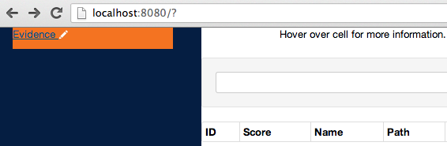
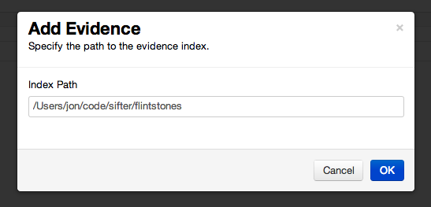
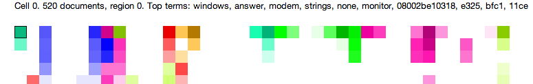
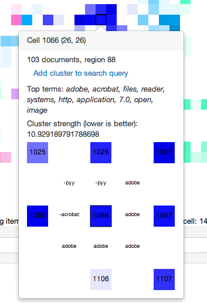
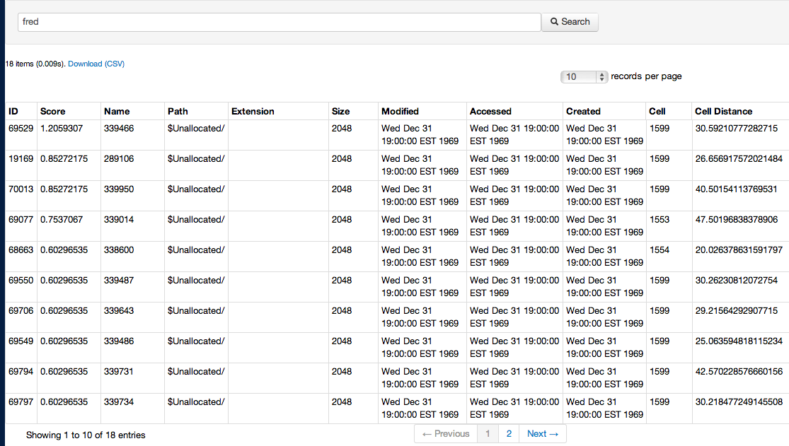
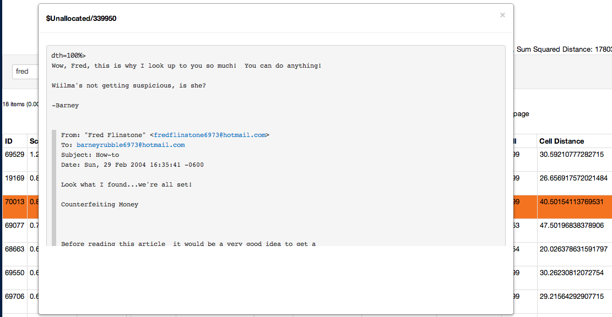

Sifter
======
Search Indexes For Text Evidence Relevantly
------------------------------------------

Sifter is a text string search application for digital forensics investigators. It indexes text from acquired images of digital media (e.g. raw and .E01), including file slack and unallocated space. Sifter allows investigators to query the index with keywords for responsive documents. Please note that throughout this manual 'documents' refers to allocated files and unallocated clusters. 

Unlike other digital forensic string search tools, Sifter intelligently displays search hits for the user in a way that makes it easier to find relevant hits and discard large groups of non-relevant hits quickly.  

Sifter improves analytical efficiency by:

* Grouping thematically related documents into cells on a graphical map, allowing the user to easily separate system related hits from human discourse, for example.
* Co-locating similar cells into similarly colored regions on a graphical map, allowing the investigator to focus on an region of cells, once a relevant cell is located.
* Ranking files and unallocated clusters containing search hits using the traditional TF-IDF ranking algorithm.
* Ranking individual search hits, much like modern search engines using a patent-pending digital forensic string search hit ranking algorithm developed by researchers at The University of Texas at San Antonio.
* Facilitating exploratory analysis of textual evidence via the graphical map without predefined search terms.
* Enabling the investigator to more easily locate relevant documents that do not match the user's exact search query.

Sifter supports traditional Boolean search queries (AND, OR, etc.), as well as more advanced Boolean operators supported by [Apache Lucene](http://lucene.apache.org). Sifter extracts meta-data and parses structured text content from various file types using [Apache Tika](http://tika.apache.org).

Sifter requires that a Java Runtime Environment (JRE) be installed, preferably 64-bit (32-bit is NOT recommended). A JRE for the user's platform may be downloaded for free from [Oracle's website](https://www.java.com/en/download/manual.jsp). The Java browser plugins, which has been the source of many security vulnerabilities, are ***not*** required for running Sifter.  Java may install these plug-ins automatically, so users are advised to disable them if desired.

The command-line examples provided in this manual are for Windows, but Sifter is entirely cross-platform.

Indexing
--------
The first step is indexing the evidence image using Sifter.  (Sifter does not yet support other indices, such as dtSearch, and is not yet integrated with forensic platforms, such as FTK and EnCase.)

First, optimize the indexing process by adjusting configuration settings in the sifter_props.xml file.  All configurable properties and recommended values are explained at the end of this manual.  Before indexing, consider the following properties:

* temp_dir: Temporary work directory location (separate index, evidence files, and temp dir on different drives if possible and/or use solid state, RAID, etc.)
* thread_pool_size: The total number of threads the user wants to dedicate to Sifter
* large_file_threshold: The size (MB) of each worker thread's memory buffer for storing file contents for indexing
* indexing_buffer_size: The size (MB) of the buffer used by Lucene

To index an evidence file, open a user-level command-line terminal and change directory to be in the Sifter program folder. Then issue the following command:

	C:\Sifter>.\bin\fsrip.exe --unallocated=block dumpfiles Evidence.E01 |
	.\index_evidence.bat IndexDirectory stoplists\stoplist_winXP.txt

where _Evidence.E01_, _IndexDirectory_, and _stoplist_winXP.txt_ are replaced according to the user's unique case.
	
This command runs the [fsrip](http://jonstewart.github.io/fsrip/) utility, which knows how to read files out of digital media, and pipes its output to the Sifter indexing utility. _Evidence.E01_ is the evidence file and _IndexDirectory_ is a path to a new top-level directory where the user would like the index to be created. 

The user must also specify the appropriate stoplist. Available stoplists are listed in the Sifter stoplists directory. The example above uses the Windows XP stoplist.  

Stoplists are provided for different operating systems.  The stoplist selected should correspond as closely as possible to the operating system on the evidence file. A basic English language stoplist (from the [Natural Language Toolkit](http://nltk.org)) is included with each operating system stoplist.  Stoplists improve the quality of the results by ensuring queries and clustering operations do not include overly common terms in the search and clustering processes.

Indexing will produce a great deal of console output, which is useful for debugging if an error occurs. 

Sifter will output indexing progress every gigabyte by printing FilePos, FileBytesRead, and FilesRead status information.

At the end, the user will see output like this:

	Successful finish
	FilesRead: 290792
	BytesRead: 1923952968
	FileBytesRead: 1735457181
	Duration: 578 seconds

Sifter attempts to extract the text of each file via parsing with the [Apache Tika](http://tika.apache.org) library. Error messages are likely to appear during indexing related to exceptions from the text extraction process. This is normal. If Tika parsing fails, then low-level text scraping (with UTF-8, followed by UTF-16) is attempted. Sifter indexes file slack and unallocated blocks as separate documents. Files that do not have any content (e.g., null clusters) are not indexed.

By using a pipe to communicate, the files from evidence do not need to be written out temporarily in order to be indexed. Sifter's indexing operation is able to buffer the input and index most files in RAM (very large files will be written to disk as temporary files to avoid exhausting memory). When a file is read in, its content is handed to a separate worker thread that extracts the text from the file using Tika and then indexes the text and accompanying file system meta-data using [Apache Lucene](http://lucene.apache.org). The total amount of memory used during indexing is largely determined by multiplying the large file threshold size (MB) by the number of threads in the pool.

For best performance, it is recommended that the evidence file and the index directory be located on separate storage devices.

Clustering
----------
After the indexing process has completed, clustering can be initiated. Clustering uses the index as its only source of input, so this can be accomplished on a machine that does not have the evidence file(s). 

Before starting the clustering process, optimize the map and process by adjusting configuration settings in the sifter_props.xml file in the Sifter program directory.  Because the clustering properties (i.e. parameters) are numerous, complex, and important, we will direct the reader to the end of the manual, where all configurable properties and recommended values are explained.  The user should be advised that these settings GREATLY impact the quality of the resultant map.  Training and experience will likely be needed to maximize map quality.

To generate the Kohonen SOM (cluster map), run this command from the command-line:

	C:\Sifter>.\make_som.bat IndexDirectory

This command reads data from the index and represents each file and unallocated cluster by a 'feature vector,' where the dimensions are terms in the lexicon and the dimension values are binary, indicating whether the file or unallocated cluster contained the term. Each binary feature vector is cycled through a randomly initialized and constantly improved Self-Organizing Map (SOM, also known as a [Kohonen Map](https://en.wikipedia.org/wiki/Self-organizing_map)), which gradually "learns" and places thematically related files and unallocated clusters into nearby cells in a two-dimensional grid.  Processing efficiency is greatly improved by using the Scalable SOM algorithm created by [Roussinov and Chen](http://citeseerx.ist.psu.edu/viewdoc/summary?doi=10.1.1.42.2569) (1998), instead of the traditional Kohonen SOM algorithm.  This is described more later in this manual.

The clustering process also generates output to give the user an idea of how far along it is in processing. Sifter prints to console how many cycles have been processed and how many iterations have been completed.  A single cycle is complete when a single 'document' has been introduced to all cells in the map.  An iteration is complete when all the cycles have occurred once—that is, all document feature vectors have been introduced to the map for learning one time.  Please note, the number of cycles will be less than the number of FilesRead from the indexing procedure, because not all 'documents' can be represented by the feature vector selected.  That is, these 'documents' do not contain any of the terms selected for the feature vector.  These documents are 'outlier docs,' which are explained further below.

At the end, Sifter will print output like this to the console:

	processed 108216 docs in this iteration, 75608 had closest cells
	Finished iteration 3
	Assigning documents to clusters
	Rescaling SOM vectors
	Assigning top terms to each cell
	Calculating greatest neighbor term difference
	Assigning cells to regions
	Writing final output
	Number of docs written: 108216
	Number of outlier docs: 32608
	Total term dimensions: 3000
	Max terms per doc: 2146
	Avg terms per doc: 19.470624801608295
	Duration: 186 seconds

'docs' refers to allocated files and unallocated clusters, and '75608 had closest cells' means that of the total number of docs considered for input, 75,608 were cluster successfully, with the remainder being outliers (noted separately in the output).

'outlier docs' are 'docs' that didn't contain any of the terms in the feature vector and thus could not be clustered.  User queries will still include these 'docs.'  Their cell number will be listed as -1.  They are simply omitted from the graphical map representation.
	
Review
------

After the clustering process has completed, the graphical map is ready to be reviewed and the index is ready to be queried in a web browser by the user.  Unlike clustering, the review process does require access to both the evidence file(s) and IndexDirectory. 

To start the graphical user interface (GUI), double-click "Start_webserver.bat" in the Sifter program directory, or run it from the command-line. Then open a web browser (IE is NOT recommended; Chrome is recommended) and go to `http://localhost:8080` in the URL bar. This will bring up the Sifter GUI. 

Sifter uses an embedded [Jetty web server](http://www.eclipse.org/jetty/) and does not need separate configuration. Sifter does not require Internet access.

### Opening Evidence

Click on the "Evidence" link in the upper-lefthand corner and enter in the full path to the index directory into the "Add Evidence" pop-up dialog.

Click "OK" and the Self-Organizing Map (SOM) graphic will be displayed, as well as a search box below it.  (Depending on the size of the map, the web browser settings, and screen resolution, the user may see significant white-space between the map and the query box.) 

### Navigating the Cluster Map (SOM)

The self-organizing map graphic represents documents in a 2-dimensional grid. Similar documents are placed into clusters, with each cluster represented by a cell in the grid. Neighboring cells tend to be similar to each other as well. Cells that share the same most frequently occurring word are grouped into the same region. White (non-colored) cells are empty--they contain no 'documents.' Cells in the same region share the same hue of color, with region colors assigned randomly like colors on a map. Darker cells contain more documents than lighter cells, and brightly colored cells indicate that the documents in the cell are more strongly related to each other than cells where the color appears dim or grayish. This is explained further below. 

Cell coloring has three dimensions:
* Hue (the color), which provides information about neighbors and regions.  Similarly colored cells, located near each other on the map are more alike one another than neighboring cells of a differing color (or cells of the same color on other parts of the map, since there is a 7-color limit).
* Saturation (color intensity), which indicates cell dispersion. More color intensity means LESS dispersion.  The more disperse a cell is, the less intense the color is, the more grey it appears, the more different its constituent 'documents' are. Thus, intensely colored cells are tightly packed.  Review of a few documents provides a good indication of the cell contents.  A less saturated color (more grey) means the cell may have more varied contents.  Accordingly, the user might be well served to explore the cell more intensely colored, than the cell that is more grey in color.
* Luminance (color brightness), which indicates the 'size' of the cell (the number of 'documents' in the cell).  More color luminance means FEWER documents in the cell.  Zero luminance would result in the color black.  Thus, the darker the color, the 'bigger' the cell is -- the more 'documents' it contains.
In sum, once a region of interest is located, the user would be well served to first evaluate dark, intensely colored cells.  The documents in these cells provides the best indication of the content of the region.

Mouse-over (hover) the colored cells in the map to display the following cell meta-data at the top of the map:

* Cell number
* Region number
* Number of documents contained in the cell 
* Top terms—the most frequently occurring words (in order of decreasing frequency) in the cell's documents (except stopwords and terms exceeding the doc_freq_threshold_high property)

Single-click on the colored cells to display a pop-up window containing the above listed mouse-over meta-data, as well as the following additional meta-data and functions:
NOTE: The cell information pop-up window can be hidden by re-clicking on the cell. Many pop-ups can be open at a time.

* Cluster strength, which indicates the amount of dispersion in the cell.  A lower value is preferred analytically, because it indicates a 'tight' cell with more closely related 'docs' in the cell.
* Neighbor relationships.  The graphical display at the bottom of the pop-up, referred to as the exploded grid view, shows the biggest term difference between the selected cell and its neighbors. In the example below, we can infer that the cell has more occurrences of the word "adobe" than its neighbors to its right and bottom, and fewer occurrences of "pyy" and "acrobat" than its neighboring cells 1025 & 1026 and 1065.  Please note, this is an advanced navigation feature that may not be entirely understood or used by beginning Sifter users.
* 'Add to query' button, which adds that cell to the search query box, but does not execute the query, allowing the user to add additional search terms via Boolean logic.
* 'List cluster docs' button, which adds that cell to the search query box and executes the query, causing Sifter to display that cell's 'docs' and hits (depending on the table view tab) in table.  
* 'Gray cell' button, which changes the color of the cell in the map to grey.  The user is advised to use this function if a cell has been analyzed and further analysis is not needed.  This may occur if the cell has been deemed not relevant, or if the user has already reviewed the cell and bookmarked relevant hits.

### Search Queries and Ranking

Search queries may be entered in the text box below the cluster map. The 'Files' view is a "Google-style" index search, where the results are returned as individual documents and sorted by a relevancy score.  Higher scores mean higher rank and theoretically more relevant to investigative objectives.  In the 'Files' table view, the ranking is a document level relevancy score using [TF-IDF](https://en.wikipedia.org/wiki/Tf-idf). In the 'Search Hits' table view, the ranking is hit-level and based on the patent-pending digital forensic text string search hit ranking algorithm developed by researchers at The University of Texas at San Antonio. 

The responsive documents are shown in a table below the search box, with columns for different meta-data fields.  Size is physical size, not bytes allocated.  Dates listed for unallocated hits are invalid (and may show "Dec 31 1969 1800 CST")  

As the user finds relevant documents or hits, the user is advised to note commonly recurring cell numbers and regions.  This way, the user can elect to run a cell-based query or refinement. The cell distance value indicates how close to the centroid the responsive 'document' or search hit is.  The centroid is the latent, central 'thematic concept' of the cell. The geometry of 'documents' within a cell is a sub-cell regional concept, proximally locating documents with more similar content. It's possible that an edge or sub-region of the cell is more relevant to the investigator than the centroid.  In that case, the user may wish to navigate in the cell specifically in that sub-region, based on the cell-distance measure.

The total number of responsive documents is shown above the table, followed by the time the query took to execute (often less than 1 second), and a link to download the result set as a CSV file.

Search queries use [Lucene's built-in syntax][SyntaxLink] and can be quite advanced, with support for Boolean logic across different fields, ranges, and term proximity in the document body. All documents can be listed simply by clicking the "Search" button with an empty query. 

The documents can be viewed somewhat in their native form in a pop-up window by clicking on the row (the hyperlinked ID).

### Bookmarking and Exporting

Sifter permits bookmarking 'documents' and hits.  Simply check the box to the left of the row containing the 'document' or hit. Once the user has a group of items checked for which he/she wishes to assign to a single bookmark, click the 'Bookmark' button on the top of the table. This will pop-up a 'Create Bookmark' dialog box, in which the user types the bookmark comment and clicks OK.  

Items that are bookmarked will have an asterisk preceding the 'document' name. Exporting the query responses to CSV will export bookmark information. Please note that unfortunately, in this release, bookmarks cannot be deleted. A 'document' may be bookmarked multiple times, however.

Clustering Algorithm Information
---------------------

Sifter implements the Scalable Self-Organizing Map algorithm described by [Roussinov](http://citeseerx.ist.psu.edu/viewdoc/summary?doi=10.1.1.42.2569). Rather than updating all weights in a cell vector after assigning a 'document' to it, the Scalable SOM algorithm uses binary term features and only updates cell weights coincident with a given document's non-zero features (using some moderately complicated algebra and somewhat more complex processes that is explained here). This effectively means that Sifter can handle thousands of features whereas a typical SOM (or other typical machine learning algorithms) can only handle a few hundred efficiently. This helps when attempting to confront the diversity of data on digital media.

The amount of memory used by Sifter during the clustering process has a lower bound of `memory used = 8 bytes * number of features * SOM height * SOM width`. 

To avoid storing all document term vectors in RAM, Sifter writes them out to a binary file and streams through it, in order, for each iteration. Because it uses an efficient serialization form and makes use of buffering, using the file does not represent a significant performance hit.

The Scalable SOM algorithm is an iterative algorithm, and not inherently data parallel. This limits the benefit of multi-threading/multiprocessing. However, Sifter will parallelize some of its operations in a fine-grained manner. The larger the SOM dimensions, the more benefit will be seen from multi-threading.

Configuration
-------------
Sifter uses a number of properties stored in an XML file to control its operation. This file is "sifter_props.xml". The user may need to edit the properties first in order to run Sifter (in particular, the user may need to change the temporary directory).

The index process properties are:

* temp_dir
 	
 	The directory where large files will be exported temporarily for indexing. The directory must already exist or else Sifter will generate an error (this will be fixed).

 * thread_pool_size

	The number of background threads to use for indexing and clustering. Ideally it should be 5–8, depending on the number of CPU cores on the workstation.
 
 * large_file_threshold
 
 	The size, in megabytes, of each worker thread's memory buffer for storing file contents. Files larger than this will be exported to the temporary directory for indexing. Note that the more workers in the threadpool, the more RAM will be used.

 * indexing_buffer_size
 
 	The size, in megabytes, of the indexing buffer used by Apache Lucene. Best performance will using be between 64–512.

The clustering process properties are:

 * som_width
 
 	The number of cell columns in the SOM.

 * som_height 
 
 	The number of cell rows in the SOM.

 * min_neighbor_radius
 
 	The minimum distance used for updating cells in the SOM on the last iteration. A good choice is 1.

 * max_neighbor_radius
 
 	The maximum distance used for updating cells in the SOM on the first iteration. Assuming a square SOM, a good choice is to use one-quarter of the SOM's dimension.

 * min_alpha
 
 	A number from 0–1, the amount to update a SOM cell with each assigned document on the last SOM iteration. A good choice is .00001.
 	
 * max_alpha
 
 	A number from 0–1, the amount to update a SOM cell with each assigned document on the first SOM iteration. A good choice is .0001.

 * num_som_iterations
 
 	The number of SOM iterations to perform before outputting the final cluster. Should be at least 2.  Increasing this value greatly affects processing time.  However, making it too small for large, complex sets of data will impact map quality.  Over iterating may be handled easily by early convergence, but may also cause the map to be come too sparse.

 * num_top_cell_terms
 
 	The number of top cell terms to display in the web application. The default is 20.

 * random_seed
 
 	An integer that's used to seed the random number generator used by the SOM algorithm. This is specified to allow for somewhat deterministic results and does not need to be changed.

 * max_vector_features
 
 	The maximum number of features to use for SOM clustering. A few hundred should be used at least, and several thousand can be used.

 * doc_freq_threshold_high
 
 	A number from 0–1, this number is the document frequency cutoff to use for choosing term features. A term that occurs in more than this number of documents relative to the number of documents in the index will not be used as a feature. The default is 0.66, i.e., a term that occurs in more than two-thirds of documents will not be used for the SOM clustering.

 * doc_freq_threshold_low
 
 	A number from 0–1, this number is the minimum document frequency threshold in order for a term to be considered for SOM clustering. The default is 0.0001.

 * min_som_term_length
 
 	The minimum length of a term to use for SOM clustering. Words/terms shorter than this length will not be considered for SOM clustering. The default is 3.

[SyntaxLink]: https://lucene.apache.org/core/4_0_0/queryparser/org/apache/lucene/queryparser/classic/package-summary.html#package_description "Lucene Query Syntax"
